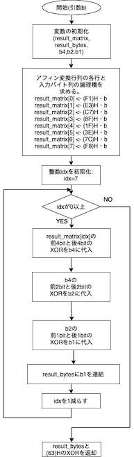

## 2. 実験I

### 2.1. 作成したプログラム
以下に示すのは`Multiply`関数、`Inverse`関数、`Affine`関数を含む`aes.c`のプログラム全体である。

```c {.line-numbers}
#include "aes128.h"

unsigned char Multiply(unsigned char x, unsigned char y) {
  unsigned char z = 0;

  while (y != 0) {
    if (y % 2 == 1) {
      z ^= x;
    }
    y = y >> 1;

    if (x >= 0x80) {
      x <<= 1;
      x ^= 0x1B;
    } else {
      x <<= 1;
    }
  }
  return z;
}

unsigned char Inverse(unsigned char b) {
  // Itoh–Tsujii inversion algorithm
  double b2, b3, b6, b12, b14, b15, b30, b60, b120, b240, b254;

  b2 = Multiply(b, b);
  b3 = Multiply(b, b2);
  b6 = Multiply(b3, b3);
  b12 = Multiply(b6, b6);
  b14 = Multiply(b2, b12);
  b15 = Multiply(b3, b12);
  b30 = Multiply(b15, b15);
  b60 = Multiply(b30, b30);
  b120 = Multiply(b60, b60);
  b240 = Multiply(b120, b120);
  b254 = Multiply(b14, b240);

  return b254;
}

unsigned char Affine(unsigned char b) {
  unsigned char result_matrix[8];
  unsigned char result_bytes = 0, b4, b2, b1;

  result_matrix[0] = 0xF1 & b;
  result_matrix[1] = 0xE3 & b;
  result_matrix[2] = 0xC7 & b;
  result_matrix[3] = 0x8F & b;

  result_matrix[4] = 0x1F & b;
  result_matrix[5] = 0x3E & b;
  result_matrix[6] = 0x7C & b;
  result_matrix[7] = 0xF8 & b;

  for (int idx = 7; idx >= 0; idx--) {
    b4 = (result_matrix[idx] >> 4) ^ result_matrix[idx];
    b2 = (b4 >> 2) ^ b4;
    b1 = (b2 >> 1 ^ b2) & 0x01;
    result_bytes = b1 ^ (result_bytes << 1);
  }

  return result_bytes ^ 0x63;
}
```

### 2.2. 利用した`Inverse`のアルゴリズム
伊藤辻井アルゴリズムと呼ばれる方式を使用した。逆元を求めたいバイトデータをbとするとき、このアルゴリズムは次の式で表される。なお`*`はMultiply関数による積を示す。

```
  b2 =    b *    b  
  b3 =    b *   b2  
  b6 =   b3 *   b3  
 b12 =   b6 *   b6  
 b14 =   b2 *  b12  
 b15 =   b3 *  b12  
 b30 =  b15 *  b15  
 b60 =  b30 *  b30  
b120 =  b60 *  b60  
b240 = b120 * b120  
b254 =  b14 * b240  
```

このアルゴリズムにより一度のInverseの処理を11回の積で実現できる。


### 2.3. `Affine`関数のフローチャート


### 2.4. `Multiply`アルゴリズムの正当性
<!-- TODO -->

AESのアルゴリズムにおいて8ビットデータは、各桁の値を係数とした7次多項式で表現される。
例えば $(10010011)_2 \rightarrow x^7+x^4+x^1+1$ のような具合である。

さらに2つの8バイトデータ $a$ , $b$ の和は各桁ごとの排他的論理和、積は $a$, $b$ それぞれの多項式表現の積の、
既約な8次多項式 $m(x)$ を法とする余剰類であり、AESにおいては $m(x) = x^8 + x^4 + x^3 + x + 1$ を利用している。

次に、 8ビットデータ$a=(a_7 a_6 a_5 a_4 a_3 a_2 a_1 a_0)_2$ と$x$(すなわち2進数表現での$(00000010)_2$)の積を考える。

第1に、$a_7$ が0であるとき、 各項の係数を$a_i$とすると
$$\begin{aligned}
a\cdot x  &= (a_6 \cdot x^6 + a_5 \cdot x^5 + a_4 \cdot x^4 + a_3 \cdot x^3 + a_2 \cdot x^2 + a_1 \cdot x^1 + a_0 \cdot 1) \cdot x \mod m(x)\\
          &= (a_6 \cdot x^7 + a_5 \cdot x^6 + a_4 \cdot x^5 + a_3 \cdot x^4 + a_2 \cdot x^3 + a_1 \cdot x^2 + a_0 \cdot x) \mod m(x) \\
          &= (a_6 \cdot x^7 + a_5 \cdot x^6 + a_4 \cdot x^5 + a_3 \cdot x^4 + a_2 \cdot x^3 + a_1 \cdot x^2 + a_0 \cdot x) \\
          &= (a_6a_5a_4a_3a_2a_1a_00)_2
\end{aligned}$$

となる。
これは $a$ の2進数表現を1ビット左にシフトしたことに対応する。

第2に、$a_7$ が1であるとき、 

$$\begin{aligned}
a\cdot x  &= (x^7 + a_6 \cdot x^6 + a_5 \cdot x^5 + a_4 \cdot x^4 + a_3 \cdot x^3 + a_2 \cdot x^2 + a_1 \cdot x^1 + a_0 \cdot 1) \cdot x \mod m(x) \\
          &= (x^8 + a_6 \cdot x^7 + a_5 \cdot x^6 + a_4 \cdot x^5 + a_3 \cdot x^4 + a_2 \cdot x^3 + a_1 \cdot x^2 + a_0 \cdot x^1 ) \mod m(x) \\
          &= x^8 \mod m(x) + (a_6 \cdot x^7 + a_5 \cdot x^6 + a_4 \cdot x^5 + a_3 \cdot x^4 + a_2 \cdot x^3 + a_1 \cdot x^2 + a_0 \cdot x^1 )  \\
          &= x^8 \mod (x^8 + x^4 + x^3 + x + 1) + (a_6 \cdot x^7 + a_5 \cdot x^6 + a_4 \cdot x^5 + a_3 \cdot x^4 + a_2 \cdot x^3 + a_1 \cdot x^2 + a_0 \cdot x^1 )  \\
          &= (x^4 + x^3 + x^1 + 1) + (a_6 \cdot x^7 + a_5 \cdot x^6 + a_4 \cdot x^5 + a_3 \cdot x^4 + a_2 \cdot x^3 + a_1 \cdot x^2 + a_0 \cdot x^1 )  \\
          &= (00011011)_2 \oplus (a_6a_5a_4a_3a_2a_1a_00)_2
\end{aligned}$$
となり、これは $a$ 2進数表現を1ビット左にシフトし、 $(81)_H$ とのXORをとった値に対応する。

これらの演算を次に示す $xtime$ の操作として定義する。
$$\begin{aligned}
xtime(a)=
\begin{cases}
\text{LSHIFT $a$}  & \text{if $a_7=0$,}\\
\text{$(81)_H\oplus$ LSHIFT $a$  } & \text{else.}
\end{cases}
\end{aligned}$$

以上を踏まえ、2つの8ビットバイトデータ   
$a=(a_7 a_6 a_5 a_4 a_3 a_2 a_1 a_0)_2$ と  
$b=(b_7 b_6 b_5 b_4 b_3 b_2 b_1 b_0)_2$ の積をとる時、  

$$ \begin{aligned}
  a\cdot b &= a\cdot((b_70000000)_2 \oplus (0b_6000000)_2 \oplus (00b_500000)_2 \oplus ... \oplus (0000000{b_0})_2) \\
  &= a\cdot(b_70000000)_2 \oplus a\cdot(0b_6000000)_2 \oplus a\cdot(00b_500000)_2 \oplus ... \oplus a\cdot(0000000b_0)_2 
 \end{aligned} $$

と変形し $xtime$ を適用することで $a$ $b$ の積を求められるようにする。

$b_i$ の値が1のとき、上式で $b_i$ を含む項の値は $a$ に $xtime$ を $i$ 回適用した値に等しい。
なぜなら $b_i$ のみが1であるような8ビットデータの多項式表現は $x^i$ のためである。

例えば $i=3$ のとき、$a\cdot(00001000)_2$ は $xtime(xtime(xtime(a)))$ と計算できる。

$xtime$ を $n$ 回適用する操作を $xtime^n$ とするとき、 $a\cdot b$ は

$$ \begin{aligned}
\sum_{i=0}^7{xtime^i(a)} \tag{1}
\end{aligned} $$

(ただし和は排他的論理和)とできる。

`Multiply`関数の擬似コードをみると、

1. $z=0$
2. $b_0$ が1であれば、 $z = z \oplus a$
3. $a=xtime(a)$
4. $b$ を1ビット左にシフト
5. $b$ が0でないならば`2`に戻る

となっている。手順2,3に注目すると、 $b_i$ が1であるとき、 $z$ の値は $xtime^i(a)$ 
であることがわかり、この`Multiply`の擬似コードは前述した2つのバイトデータ, $a$ , $b$ の積 $z$ を返すことが確認できる。


### 2.5. 4バイトデータと1ワードデータの双方向変換の`union`による実現
keyexpand.cでは、4バイトデータと1ワードデータの相互変換をaes128.hで定義される`key_t`型のunion(共用体)変数を用いて行っている。

C言語においてunionとは、同じメモリ領域を複数の型の変数が共有する共用体のデータ構造である。

`key_t`型では`unsigned long int`型の`word`(32ビット)と`unsigned char[4]`型の`byte`(8ビット*4)が同じメモリ領域を共有している。
unionの初期化は先頭のメンバ変数の型で行われるため、`key_t`型の場合、メモリ上に32ビットの連続した領域が確保される。

例えば`0x12345678`というデータで`key_t`型の変数`x`を初期化すると、`x.word`でワードデータとして、
`x.byte[1]`で2バイト目のデータ(0x34)を得ることができる。


### 2.6. `test1.o`で用いたブロックと暗号鍵、及び実行結果

次のようにして`aes.c`をコンパイルし実行ファイル`bin/exp1`を作成した。

```
/bin/cc -o bin/exp1 \
  aes.c \
  cipherH.o debug.o shiftrows.o addroundkey.o \
  subbytes.o mixcolumns.o \
  keyexpand1.o test1.o
```

- 使用したブロック(PLAINTEXT)
  - `00112233445566778899aabbccddeeff`
- 使用した暗号鍵(KEY)
  - `000102030405060708090a0b0c0d0e0f`
- `bin/exp1`の実行結果

```
PLAINTEXT:       00112233445566778899aabbccddeeff
KEY:             000102030405060708090a0b0c0d0e0f
CIPHER (ENCRIPT):
round[ 0].input  00112233445566778899aabbccddeeff
round[ 0].k_sch  000102030405060708090a0b0c0d0e0f
round[ 1].start  00102030405060708090a0b0c0d0e0f0
round[ 1].s_box  63cab7040953d051cd60e0e7ba70e18c
round[ 1].s_row  6353e08c0960e104cd70b751bacad0e7
round[ 1].m_col  5f72641557f5bc92f7be3b291db9f91a
round[ 1].k_sch  d6aa74fdd2af72fadaa678f1d6ab76fe
round[ 2].start  89d810e8855ace682d1843d8cb128fe4
round[ 2].s_box  a761ca9b97be8b45d8ad1a611fc97369
round[ 2].s_row  a7be1a6997ad739bd8c9ca451f618b61
round[ 2].m_col  ff87968431d86a51645151fa773ad009
round[ 2].k_sch  b692cf0b643dbdf1be9bc5006830b3fe
round[ 3].start  4915598f55e5d7a0daca94fa1f0a63f7
round[ 3].s_box  3b59cb73fcd90ee05774222dc067fb68
round[ 3].s_row  3bd92268fc74fb735767cbe0c0590e2d
round[ 3].m_col  4c9c1e66f771f0762c3f868e534df256
round[ 3].k_sch  b6ff744ed2c2c9bf6c590cbf0469bf41
round[ 4].start  fa636a2825b339c940668a3157244d17
round[ 4].s_box  2dfb02343f6d12dd09337ec75b36e3f0
round[ 4].s_row  2d6d7ef03f33e334093602dd5bfb12c7
round[ 4].m_col  6385b79ffc538df997be478e7547d691
round[ 4].k_sch  47f7f7bc95353e03f96c32bcfd058dfd
round[ 5].start  247240236966b3fa6ed2753288425b6c
round[ 5].s_box  36400926f9336d2d9fb59d23c42c3950
round[ 5].s_row  36339d50f9b539269f2c092dc4406d23
round[ 5].m_col  f4bcd45432e554d075f1d6c51dd03b3c
round[ 5].k_sch  3caaa3e8a99f9deb50f3af57adf622aa
round[ 6].start  c81677bc9b7ac93b25027992b0261996
round[ 6].s_box  e847f56514dadde23f77b64fe7f7d490
round[ 6].s_row  e8dab6901477d4653ff7f5e2e747dd4f
round[ 6].m_col  9816ee7400f87f556b2c049c8e5ad036
round[ 6].k_sch  5e390f7df7a69296a7553dc10aa31f6b
round[ 7].start  c62fe109f75eedc3cc79395d84f9cf5d
round[ 7].s_box  b415f8016858552e4bb6124c5f998a4c
round[ 7].s_row  b458124c68b68a014b99f82e5f15554c
round[ 7].m_col  c57e1c159a9bd286f05f4be098c63439
round[ 7].k_sch  14f9701ae35fe28c440adf4d4ea9c026
round[ 8].start  d1876c0f79c4300ab45594add66ff41f
round[ 8].s_box  3e175076b61c04678dfc2295f6a8bfc0
round[ 8].s_row  3e1c22c0b6fcbf768da85067f6170495
round[ 8].m_col  baa03de7a1f9b56ed5512cba5f414d23
round[ 8].k_sch  47438735a41c65b9e016baf4aebf7ad2
round[ 9].start  fde3bad205e5d0d73547964ef1fe37f1
round[ 9].s_box  5411f4b56bd9700e96a0902fa1bb9aa1
round[ 9].s_row  54d990a16ba09ab596bbf40ea111702f
round[ 9].m_col  e9f74eec023020f61bf2ccf2353c21c7
round[ 9].k_sch  549932d1f08557681093ed9cbe2c974e
round[10].start  bd6e7c3df2b5779e0b61216e8b10b689
round[10].s_box  7a9f102789d5f50b2beffd9f3dca4ea7
round[10].s_row  7ad5fda789ef4e272bca100b3d9ff59f
round[10].k_sch  13111d7fe3944a17f307a78b4d2b30c5
round[10].output 69c4e0d86a7b0430d8cdb78070b4c55a
```