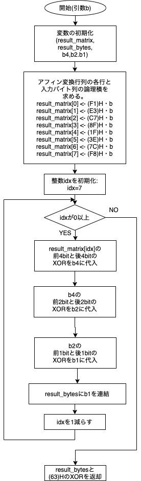

# 暗号化プログラミングレポート

# 目的
- 広く利用されているAES暗号の暗号化プログラムを実装することで、対称ブロック暗号(symmetric block cipher)について学ぶ。
- 平文と暗号文の線形性を壊すために、離散数学(ガロア体理論に基づくバイト演算)が応用されていることを学ぶ。
- 暗号化で不可欠なビット演算のプログラミングを学ぶ。
- 事前計算(precalculation)とルックアップテーブル(lookup table)を利用した高速化を学ぶ。

----
## 実行環境
Dockerを用いて実験の環境を構築した。比較のためにネイティブで動作するUbuntuでも動作の確認をした。
1. OS: macOS 12.0.1 21A558 arm64
    - Docker: 20.10.8, build 3967b7d
        - カーネル: 5.10.47-linuxkit
        - bash: 5.0.17
        - cc: (Ubuntu 9.3.0-17ubuntu1~20.04) 9.3.0
        - make: GNU Make 4.2.1

2. OS: Ubuntu 20.04.2 LTS x86_6
    - カーネル: 5.8.0-63-generic
    - bash: 5.0.17
    - cc: (Ubuntu 9.3.0-17ubuntu1~20.04) 9.3.0
    - make: GNU Make 4.2.1

コンテナは次のファイルを用い、フラグとして`--platform='linux/amd64'`を指定しビルドした。

```Dockerfile
FROM ubuntu:latest
WORKDIR /home
RUN apt update && \
    apt upgrade -y && \
    apt install gcc make -y
CMD ["/usr/bin/bash","-l"]
```

---

# 実験I

## 作成したプログラム
以下に示すのは`Multiply`関数、`Inverse`関数、`Affine`関数を含む`aes.c`のプログラム全体である。

```cc
#include "aes128.h"

unsigned char Multiply(unsigned char x, unsigned char y) {
  unsigned char z = 0;

  while (y != 0) {
    if (y % 2 == 1) {
      z ^= x;
    }
    y = y >> 1;

    if (x >= 0x80) {
      x <<= 1;
      x ^= 0x1B;
    } else {
      x <<= 1;
    }
  }
  return z;
}

unsigned char Inverse(unsigned char b) {
  double b2, b4, b8, b16, b32, b64, b128, b254;

  b2 = Multiply(b, b);
  b4 = Multiply(b2, b2);
  b8 = Multiply(b4, b4);
  b16 = Multiply(b8, b8);
  b32 = Multiply(b16, b16);
  b64 = Multiply(b32, b32);
  b128 = Multiply(b64, b64);
  b254 = Multiply(
      Multiply(Multiply(Multiply(Multiply(Multiply(b2, b4), b8), b16), b32),
               b64),
      b128);
  return b254;
}

unsigned char Affine(unsigned char b) {
  unsigned char result_matrix[8];
  unsigned char result_bytes = 0, b4, b2, b1;

  result_matrix[0] = 0xF1 & b;
  result_matrix[1] = 0xE3 & b;
  result_matrix[2] = 0xC7 & b;
  result_matrix[3] = 0x8F & b;

  result_matrix[4] = 0x1F & b;
  result_matrix[5] = 0x3E & b;
  result_matrix[6] = 0x7C & b;
  result_matrix[7] = 0xF8 & b;

  for (int idx = 7; idx >= 0; idx--) {
    b4 = (result_matrix[idx] >> 4) ^ result_matrix[idx];
    b2 = (b4 >> 2) ^ b4;
    b1 = (b2 >> 1 ^ b2) & 0x01;
    result_bytes = b1 ^ (result_bytes << 1);
  }

  return result_bytes ^ 0x63;
}
```

## 利用した`Inverse`のアルゴリズム
上記の`aes.c`に示した通り、Inverse関数のアルゴリズムとして、資料に示されてる「計算方法2」を使用した。

## `Affine`関数のフローチャート


## `Multiply`アルゴリズムの正当性
## 4バイトデータと1ワードデータの双方向変換の`union`による実現
keyexpand.cでは、4バイトデータと1ワードデータの相互変換をaes128.hで定義される`key_t`型のunion(共用体)変数を用いて行っている。

C言語においてunionとは、同じメモリ領域を複数の型の変数が共有する共用体のデータ構造である。

`key_t`型では`unsigned long int`型の`word`(32ビット)と`unsigned char[4]`型の`byte`(8ビット*4)が同じメモリ領域を共有している。
unionの初期化は先頭のメンバ変数の型で行われるため、`key_t`型の場合、メモリ上に32ビットの連続した領域が確保される。

例えば`0x12345678`というデータで`key_t`型の変数`x`を初期化すると、`x.word`でワードデータとして、
`x.byte[1]`で2バイト目のデータ(0x34)を得ることができる。


---


# 実験II
## 作成したプログラム
### ルックアップテーブルの出力
ルックアップテーブル`sbox.c`,`mbox02.c`,`mbox03.c`を生成するプログラムとして、
`gen_sbox.c`,`gen_mbox02.c`,`gen_mbox03.c`を作成した。

以下が作成したプログラムの内容である。
- `gen_sbox.c`

```cc
#include "aes128.h"
#include <stdio.h>

int main(void) {
  printf("unsigned char sbox[256] = {");
  for (int b = 0; b <= 254; b++) {
    printf("0x%02X, ", Affine(Inverse(b)));
  }
  printf("0x%02X };\n", Affine(Inverse(255)));
  return 0;
}
```

- `gen_mbox02.c`

```cc
#include "aes128.h"
#include <stdio.h>

int main(void) {
  printf("unsigned char mbox02[256] = {");
  for (unsigned char b = 0; b <= 254; b++) {
    printf("0x%02X, ", Multiply(b, 0x02));
  }
  printf("0x%02X };\n", Multiply(255, 0x02));
  return 0;
}
```

- `gen_mbox03.c`

```cc
#include "aes128.h"
#include <stdio.h>

int main(void) {
  printf("unsigned char mbox03[256] = {");
  for (unsigned char b = 0; b <= 254; b++) {
    printf("0x%02X, ", Multiply(b, 0x03));
  }
  printf("0x%02X };\n", Multiply(255, 0x03));
  return 0;
}
```

以上のプログラムを次に抜粋して示すMakefileでコンパイルしルックアップテーブルを生成した。

```
SHELL = /bin/bash
CC = /bin/cc
BIN = ./bin

# 実験2: 配列コード生成
gen_boxes: gen_sbox gen_mbox02 gen_mbox03
	@$(BIN)/gen_sbox > sbox.c
	@$(BIN)/gen_mbox02 > mbox02.c
	@$(BIN)/gen_mbox03 > mbox03.c
	@$(CC) -c sbox.c
	@$(CC) -c mbox02.c
	@$(CC) -c mbox03.c

gen_sbox: gen_sbox.o aes.o
	$(CC) -o $(BIN)/gen_sbox \
		gen_sbox.o aes.o

gen_mbox02: gen_mbox02.o aes.o
	$(CC) -o $(BIN)/gen_mbox02 \
 		gen_mbox02.o aes.o

gen_mbox03: gen_mbox03.o aes.o
	$(CC) -o $(BIN)/gen_mbox03 \
 		gen_mbox03.o aes.o
```

以上のプログラムをそれぞれコンパイルし実行ファイル

### 高速化した`SubBytes`関数,`MixColumns`関数
上記に示したルックアップテーブルを用い、高速化を図った
`SubBytes`関数と`MixColumns`関数をそれぞれ
`subbytes_lut.c`,`mixcolumns_lut.c`に作成した。


## 事前計算で得られた`sbox`の値：

## 事前計算で得られた`mbox02,mbox03`の値：

## 高速化率

---

# 考察